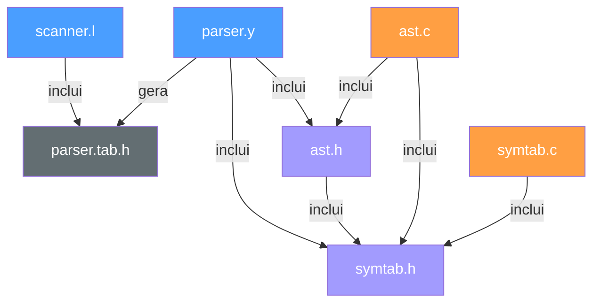

# Arquitetura do Interpretador — Documentação Técnica

> **FGA0003 — Compiladores 1**
> Curso de Engenharia de Software — Universidade de Brasília (UnB)

---

## 1. Visão Geral do Pipeline

O interpretador opera em um pipeline de **três fases sequenciais**, onde a saída de cada fase é a entrada da próxima. Diferentemente de um compilador convencional (que gera código objeto), nosso projeto interpreta o programa-fonte diretamente: constrói uma representação intermediária em memória (a AST) e a percorre para executar cada instrução.

```
┌──────────────┐     tokens     ┌──────────────┐      AST      ┌──────────────┐
│   Scanner    │───────────────▶│    Parser     │──────────────▶│  Avaliador   │
│   (Flex)     │                │   (Bison)     │               │  (eval_ast)  │
│  scanner.l   │                │   parser.y    │               │    ast.c     │
└──────────────┘                └──────────────┘               └──────────────┘
                                                                      │
                                                                      ▼
                                                               ┌──────────────┐
                                                               │   Tabela de  │
                                                               │   Símbolos   │
                                                               │   symtab.c   │
                                                               └──────────────┘
```

**Fluxo de execução do `main()` (em `parser.y`):**

1. O Bison invoca `yyparse()`, que chama `yylex()` repetidamente para obter tokens.
2. As ações semânticas do parser **apenas constroem nós da AST** — nenhum cálculo, I/O ou manipulação da tabela de símbolos ocorre nesta fase.
3. Após o parsing bem-sucedido, `ast_root` aponta para a raiz da AST.
4. A AST é impressa para depuração (`print_ast`).
5. O avaliador percorre a AST nó a nó via `eval_ast()`, executando o programa.
6. A tabela de símbolos é impressa e toda memória é liberada.

> **Decisão de projeto chave:** a separação rigorosa entre construção da AST (parsing) e execução (avaliação) permite, no futuro, inserir fases intermediárias (otimização, geração de código) sem alterar o parser.

---

## 2. Análise Léxica — `scanner.l`

O analisador léxico é implementado em **Flex** e é responsável por decompor o texto-fonte em tokens tipados.

### 2.1 Categorias de tokens reconhecidos

| Categoria             | Exemplos                        | Token(s) Bison          |
|-----------------------|---------------------------------|-------------------------|
| Literais inteiros     | `42`, `0`, `1000`               | `NUM`                   |
| Literais float        | `3.14`, `.5`, `10.`             | `FLOAT_LIT`             |
| Literais caractere    | `'a'`, `'\n'`, `'\0'`           | `CHAR_LIT`              |
| Literais booleanos    | `true`, `false`                 | `TRUE_LIT`, `FALSE_LIT` |
| Identificadores       | `x`, `contador`, `_var1`        | `ID`                    |
| Palavras-chave tipo   | `int`, `float`, `char`, `bool`  | `T_INT`, `T_FLOAT`, ... |
| Controle de fluxo     | `if`, `else`, `while`, `for`    | `KW_IF`, `KW_ELSE`, ... |
| Operadores aritméticos| `+`, `-`, `*`, `/`              | `PLUS`, `MINUS`, ...    |
| Operadores relacionais| `<`, `>`, `<=`, `>=`, `==`, `!=`| `LT`, `GT`, `LE`, ...  |
| Operadores lógicos    | `&&`, `||`, `!`                 | `AND`, `OR`, `NOT`      |
| Delimitadores         | `(`, `)`, `{`, `}`, `;`, `=`   | `LPAREN`, `ASSIGN`, ... |

### 2.2 Detalhes de implementação relevantes

- **Maximal munch para floats:** a regra de ponto flutuante (`[0-9]+\.[0-9]*|\.[0-9]+`) aparece **antes** da regra de inteiros. Isso garante que `3.14` seja reconhecido como `FLOAT_LIT` e não como `NUM` + `.` + `NUM`.

- **Escape sequences:** o scanner suporta as sequências de escape padrão C (`\a`, `\b`, `\f`, `\n`, `\r`, `\t`, `\v`, `\\`, `\'`, `\"`, `\?`, `\0`). Escapes não reconhecidos geram um aviso e utilizam o caractere literal que segue a barra.

- **Palavras-chave vs. identificadores:** as regras de palavras-chave (`int`, `if`, `true`, etc.) são posicionadas **antes** da regra geral de identificadores. Como o Flex prioriza a primeira regra em caso de empate, isso garante que `int` seja reconhecido como `T_INT` e não como `ID`.

- **Valores semânticos:** cada token carrega seu valor na `yylval` adequada. Por exemplo, `NUM` preenche `yylval.intValue` via `atoi()`, enquanto `ID` aloca uma cópia com `strdup()` em `yylval.strValue`.

- **Interface com o parser:** o scanner inclui `parser.tab.h` (gerado pelo Bison), que define os códigos numéricos dos tokens e a `union YYSTYPE`.

### 2.3 ⚠️ Diferenças em relação ao C padrão

| Aspecto | Nosso interpretador | C padrão (ISO C11) |
|---------|--------------------|--------------------|
| Literais float | Apenas notação decimal (`3.14`, `.5`) | Suporta também notação científica (`1e-3`) e hexadecimal float (`0x1.fp10`) |
| Literais inteiros | Apenas base decimal | Suporta octal (`077`), hexadecimal (`0xFF`) e binário (`0b1010` no C23) |
| Literais caractere | Escapes básicos suportados | Suporta também escapes octais (`\077`) e hexadecimais (`\x7F`) |
| Strings | **Não suportadas** como tipo completo | Strings com tipo `char[]`/`char*`, concatenação, etc. |
| Comentários | **Não suportados** | `//` e `/* */` |
| Preprocessador | **Inexistente** | `#include`, `#define`, `#ifdef`, etc. |

---

## 3. Análise Sintática — `parser.y`

O parser é implementado em **Bison** e produz uma gramática **LALR(1)** que constrói a AST.

### 3.1 Estrutura da gramática

```
program
  └─ line_list           (lista encadeada de statements)
       └─ line
            └─ stmt
                 ├─ expr SEMICOLON           → AST_EXPR_STMT
                 ├─ ID ASSIGN expr ;         → AST_ASSIGN
                 ├─ type_spec ID ;           → AST_DECL (sem init)
                 ├─ type_spec ID = expr ;    → AST_DECL (com init)
                 ├─ if (expr) stmt [else stmt] → AST_IF
                 ├─ while (expr) stmt        → AST_WHILE
                 ├─ for (init;cond;step) stmt → AST_FOR
                 └─ { stmt_list }            → AST_BLOCK
```

### 3.2 Precedência de operadores

A precedência é definida de menor para maior:

```
OR  <  AND  <  EQ NE  <  LT GT LE GE  <  PLUS MINUS  <  TIMES DIVIDE  <  NOT UMINUS
```

Essa hierarquia replica fielmente a do C padrão para o subconjunto de operadores suportados.

### 3.3 Conflito shift/reduce do *dangling-else*

A gramática apresenta **exatamente 1 conflito shift/reduce** esperado, causado pela ambiguidade clássica do *dangling-else*:

```c
if (a) if (b) x = 1; else x = 2;
```

O Bison resolve por **shift** (associa o `else` ao `if` mais interno), que é a semântica padrão do C. Isso é declarado explicitamente com `%expect 1`.

### 3.4 Construção de listas com `append_node()`

Os nós da AST são encadeados em listas via o campo `next` do `ASTNode`. A função `append_node()` percorre a lista até o final e anexa o novo nó. Essa abordagem resulta em complexidade **O(n²)** para a construção de listas longas (onde *n* é o número de statements), mas é suficiente para os programas-fonte do escopo do projeto.

> **Possível melhoria:** manter um ponteiro para o último nó da lista eliminaria a travessia repetida, reduzindo a complexidade para O(n).

### 3.5 Liberação de memória de identificadores

Quando o scanner aloca um `strdup()` para um identificador e o parser o consome em uma ação semântica (ex: `new_assign_node($1, $3)`), o construtor do nó faz sua **própria cópia interna** via `strdup()`. A ação semântica então chama `free($1)` para liberar a cópia do Flex, evitando memory leaks.

### 3.6 ⚠️ Diferenças em relação ao C padrão

| Aspecto | Nosso interpretador | C padrão |
|---------|--------------------| ---------|
| Declarações | Apenas uma variável por declaração (`int x;`) | Suporta múltiplas (`int x, y, z;`) e declaração com ponteiros (`int *p;`) |
| Inicialização no `for` | Declaração ou atribuição (apenas 1 variável) | Qualquer expressão, incluindo operador vírgula |
| Step do `for` | Apenas atribuição (`i = i + 1`) | Qualquer expressão (`i++`, `i += 1`, chamadas) |
| `printf` / I/O | O interpretador imprime automaticamente resultados de expressões e atribuições | Requer chamadas explícitas a `printf()`, `scanf()`, etc. |
| Funções | **Não suportadas** | Declaração, definição e chamada de funções |
| Arrays e ponteiros | **Não suportados** | Tipos fundamentais da linguagem |
| `switch`, `do-while` | **Não suportados** | Construções padrão de controle de fluxo |
| `break`, `continue`, `return` | **Não suportados** | Saída antecipada de loops e funções |
| Operador vírgula | **Não suportado** | Avaliação sequencial de expressões |
| Operadores bit-a-bit | **Não suportados** (`&`, `|`, `^`, `~`, `<<`, `>>`) | Suportados |
| Incremento/decremento | **Não suportados** (`++`, `--`) | Operadores unários pré/pós-fixados |
| Operadores compostos | **Não suportados** (`+=`, `-=`, `*=`, `/=`) | Atribuição composta |

---

## 4. Árvore Sintática Abstrata (AST) — `ast.h` / `ast.c`

### 4.1 Estrutura do nó

Cada nó da AST é uma `struct ASTNode` com a seguinte organização:

```c
typedef struct ASTNode {
    NodeType kind;              // Tipo do nó (enum)
    struct ASTNode *next;       // Próximo nó na lista encadeada

    union {
        struct { int value; } num;           // AST_NUM
        struct { double value; } flt;        // AST_FLOAT
        struct { char value; } chr;          // AST_CHAR
        struct { int value; } bln;           // AST_BOOL
        struct { char *name; } id;           // AST_ID
        struct { int op; ASTNode *left, *right; } binop;    // AST_BINOP
        struct { int op; ASTNode *operand; } unaryop;       // AST_UNARYOP
        struct { char *name; ASTNode *expr; } assign;       // AST_ASSIGN
        struct { SymType type; char *name; ASTNode *init; } decl;  // AST_DECL
        struct { ASTNode *expr; } expr_stmt;                // AST_EXPR_STMT
        struct { ASTNode *cond, *then_branch, *else_branch; } if_stmt;   // AST_IF
        struct { ASTNode *cond, *body; } while_stmt;        // AST_WHILE
        struct { ASTNode *init, *cond, *step, *body; } for_stmt;  // AST_FOR
        struct { ASTNode *stmts; } block;                   // AST_BLOCK
    } data;
} ASTNode;
```

**Decisão de projeto:** o uso de uma `union` discriminada (tagged union) minimiza o uso de memória — cada nó ocupa o tamanho do maior membro da union, independentemente do tipo real. O campo `kind` (a *tag*) determina qual membro da union é válido.

### 4.2 O campo `next` — Lista intrusiva

O campo `next` na **base** da struct (fora da union) permite que **qualquer** tipo de nó participe de uma lista encadeada. Isso é utilizado para:

- Encadear statements em sequência dentro de um programa (`line_list`)
- Encadear statements dentro de um bloco `{ }` (`stmt_list`)

Esse padrão é chamado de **lista intrusiva** (*intrusive list*): o ponteiro de encadeamento faz parte do próprio elemento, não de um container externo.

> **Detalhe crítico:** `eval_ast()` **NÃO** percorre `->next` automaticamente. A responsabilidade de iterar a lista é da função `exec_list()` ou do loop no `main()`. Isso permite que `eval_ast()` avalie um único nó de forma isolada (necessário para subexpressões, condições, etc.).

### 4.3 Codificação de operadores

Os operadores são codificados como valores `int` usando uma convenção mista:

| Operador | Código interno | Lógica |
|----------|---------------|--------|
| `+`, `-`, `*`, `/` | `'+'`, `'-'`, `'*'`, `'/'` | Caractere ASCII diretamente |
| `<`, `>` | `'<'`, `'>'` | Caractere ASCII diretamente |
| `&&` | `'&'` | Caractere que representa o conceito |
| `||` | `'|'` | Caractere que representa o conceito |
| `!` | `'!'` | Caractere ASCII diretamente |
| `==` | `'E'` | Mnemônico: **E**qual |
| `!=` | `'N'` | Mnemônico: **N**ot equal |
| `<=` | `'l'` | Mnemônico: **l**ess-or-equal |
| `>=` | `'g'` | Mnemônico: **g**reater-or-equal |

Essa codificação evita a necessidade de um enum separado para operadores e permite usar `switch` de forma eficiente, mas sacrifica legibilidade (o leitor precisa conhecer a convenção).

### 4.4 Alocação e liberação de memória

- **Alocação:** `alloc_node()` usa `calloc(1, sizeof(ASTNode))`, que zera toda a memória. Isso garante que ponteiros não inicializados sejam `NULL` e valores numéricos comecem em zero.
- **Liberação:** `free_ast()` percorre recursivamente toda a árvore (incluindo `->next`), liberando strings duplicadas (`strdup`) e os próprios nós. A travessia ocorre em **pós-ordem** (filhos antes do pai).

---

## 5. Avaliador (Interpretador) — `eval_ast()`

O avaliador é o coração do interpretador: um **tree-walking interpreter** que percorre a AST recursivamente e executa o programa.

### 5.1 O tipo `EvalResult`

Toda expressão avaliada retorna um `EvalResult`:

```c
typedef struct {
    double val;    // Valor numérico (double para uniformidade)
    SymType type;  // Tipo semântico do resultado
} EvalResult;
```

**Decisão de projeto:** usar `double` como tipo interno universal simplifica a implementação — não é necessário um segundo nível de union para resultados intermediários. O campo `type` preserva a informação semântica para conversões e formatação.

### 5.2 Sistema de tipos e promoção

A função `promote_type()` implementa **promoção aritmética simplificada**:

```
Se qualquer operando for float → resultado é float
Caso contrário → resultado é int
```

Os tipos `char` e `bool` são **implicitamente promovidos a `int`** em operações aritméticas, o que é consistente com o C padrão (*integer promotion*).

### 5.3 Divisão inteira vs. divisão de ponto flutuante

A divisão respeita a semântica do C:

```c
// Se ambos operandos são inteiros: divisão inteira (truncamento)
result.val = (double)((int)left.val / (int)right.val);

// Se algum operando é float: divisão de ponto flutuante
result.val = left.val / right.val;
```

Exemplo: `7 / 2` → `3` (inteiro), mas `7.0 / 2` → `3.5` (float).

### 5.4 Divisão por zero

Divisão por zero é detectada em tempo de execução e causa **término imediato** do programa com mensagem de erro. No C padrão, divisão inteira por zero é *undefined behavior*; aqui, o comportamento é determinístico.

### 5.5 Operadores lógicos e relacionais

Os operadores lógicos (`&&`, `||`) e relacionais (`<`, `>`, `<=`, `>=`, `==`, `!=`) **sempre retornam `TYPE_INT`** com valor `0` ou `1`, replicando a convenção do C (onde não existe tipo booleano nativo nos padrões anteriores ao C23).

### 5.6 Conversão na atribuição

Ao atribuir um valor a uma variável, `to_sym_value()` converte o `double` intermediário para o tipo declarado da variável:

```c
// float x; x = 42;  → x armazena 42.0f
// int y;   y = 3.7; → y armazena 3 (truncamento)
// bool b;  b = 42;  → b armazena 1 (!!42 == 1)
// char c;  c = 65;  → c armazena 'A'
```

Essa conversão implícita replica o comportamento do C (*implicit narrowing conversion*).

### 5.7 Saída automática

O interpretador imprime automaticamente:
- **Declarações:** `Declarado: x : int = 0`
- **Atribuições:** `int x = 5`
- **Expressões livres (`expr;`):** `Resultado: 42`

Isso é uma conveniência educacional — no C padrão, nenhuma dessas operações produz saída sem chamada explícita a `printf()`.

### 5.8 Controle de fluxo

| Construção | Comportamento |
|------------|--------------|
| `if/else` | Avalia a condição como `double != 0.0` (truthy). Executa o branch apropriado via `exec_list()`. |
| `while` | Loop infinito com teste de condição no início. Sai quando a condição é `0.0`. |
| `for` | Executa init uma vez, depois loop com teste de condição, corpo, e step. Todos os componentes são opcionais (condição omitida = loop infinito). |
| Blocos `{}` | Executa a lista de statements sequencialmente via `exec_list()`. |

### 5.9 ⚠️ Diferenças na avaliação em relação ao C padrão

| Aspecto | Nosso interpretador | C padrão |
|---------|--------------------| ---------|
| Representação interna | Todos os valores intermediários são `double` | Tipos preservam tamanho nativo (`int` = 32 bits, `float` = IEEE 754 single) |
| Float na tabela de símbolos | Armazenado como `float` (32 bits), mas intermediários são `double` (64 bits) | `float` é 32 bits, `double` é 64 bits, com promoção explícita |
| Overflow de inteiros | Limitado à precisão do `double` (~2⁵³) durante cálculos, depois truncado para `int` (32 bits) | Overflow de signed int é undefined behavior |
| Short-circuit evaluation | **Não implementada** — ambos os operandos de `&&` e `||` são sempre avaliados | Avaliação curto-circuito é garantida |
| Escopo de variáveis | **Escopo global único** — blocos `{}` não criam escopo léxico | Blocos criam escopo léxico; variáveis são destruídas ao sair do bloco |
| Redeclaração | Erro fatal | Permitida em escopos diferentes |
| Uso antes da declaração | Erro fatal (variável não encontrada na tabela) | Undefined behavior (em muitos casos) |
| `for` init com declaração | A variável persiste após o loop (escopo global) | A variável é destruída ao sair do `for` |
| Valor de `true`/`false` | Literais booleanos com `TYPE_BOOL` | `true`/`false` são macros (C99+) ou keywords (C23) com tipo `int`/`_Bool` |

---

## 6. Tabela de Símbolos — `symtab.h` / `symtab.c`

### 6.1 Estrutura de dados

A tabela de símbolos é uma **hash table de tamanho fixo** com **encadeamento externo** (*chaining*).

```
table[0]   → NULL
table[1]   → SymEntry("x") → SymEntry("y") → NULL
table[2]   → NULL
...
table[210] → SymEntry("z") → NULL
```

- **Tamanho:** 211 buckets (número primo, para melhor distribuição de hash).
- **Função de hash:** djb2 de Dan Bernstein (`h = h * 33 + c`), reduzida por módulo ao tamanho da tabela.
- **Inserção:** no **início** da lista encadeada do bucket — O(1).
- **Busca:** percorre a lista do bucket comparando strings — O(k) no pior caso, onde *k* é o comprimento da cadeia.

### 6.2 Armazenamento de valores tipados

O valor de cada variável é armazenado como uma `SymValue` (union discriminada):

```c
typedef union {
    int   iVal;   // TYPE_INT, TYPE_BOOL
    float fVal;   // TYPE_FLOAT
    char  cVal;   // TYPE_CHAR
} SymValue;
```

O campo `type` da `SymEntry` determina qual membro da union é válido. `TYPE_BOOL` reutiliza `iVal` (0 ou 1), seguindo a convenção do C.

### 6.3 ⚠️ Limitações em relação ao C padrão

| Aspecto | Nosso interpretador | C padrão |
|---------|--------------------| ---------|
| Escopo | **Único escopo global** — sem escopo de bloco, de função ou de arquivo | Escopo léxico hierárquico (bloco, função, arquivo, linkage) |
| Tipos | `int`, `float`, `char`, `bool` | Dezenas de tipos (incluindo `long`, `double`, `unsigned`, structs, enums, unions, ponteiros, arrays, etc.) |
| Array estático | Tamanho fixo (211 buckets) | N/A (a tabela de símbolos é um detalhe de implementação do compilador, não da linguagem) |
| Lifetime | Variáveis existem do momento da declaração até o fim do programa | *automatic*, *static*, *thread*, *allocated* (4 storage durations) |

---

## 7. Compilação e Build — `Makefile`

O sistema de build compila dois executáveis independentes:

### 7.1 `parser_exe` — O interpretador principal

```
Bison (parser.y) → parser.tab.c + parser.tab.h
Flex  (scanner.l) → lex.yy.c    (depende de parser.tab.h)
GCC: parser.tab.c + lex.yy.c + symtab.c + ast.c → parser_exe
```

Não linka com `-lfl` porque `parser.y` fornece `main()` e `scanner.l` fornece `yywrap()`.

### 7.2 `lexer_exe` — Lexer standalone

Um analisador léxico independente (`examples/lexer.l`) que reconhece um subconjunto maior do C (incluindo comentários, `long`, `double`, `switch`, etc.). Utiliza `-lfl` para obter o `main()` padrão do Flex.

### 7.3 Diretório de build

Todos os artefatos gerados (`.tab.c`, `.tab.h`, `.yy.c`, executáveis) ficam no diretório `build/`, mantendo o diretório-fonte limpo.

---

## 8. Arquitetura de Testes

O projeto utiliza **pytest** como framework de testes, com executáveis C compilados como backends:

```
pytest (Python)
  ├─ test_lexer.py    → invoca lexer_test_exe (C)
  ├─ test_scanner.py  → invoca scanner_test_exe (C)
  └─ test_parser.py   → invoca parser_exe (C)
```

Os testes em Python escrevem arquivos temporários com programas-fonte, invocam o executável correspondente via `subprocess`, e verificam a saída padrão com asserções.

---

## 9. Diagrama de Dependências entre Módulos



**Legenda:** 🔵 Fontes Flex/Bison | 🟠 Implementações C | 🟣 Cabeçalhos | ⚫ Gerado

---

## 10. Resumo das Diferenças mais Significativas em Relação ao C Padrão

### O que implementamos fielmente:
- ✅ Precedência e associatividade dos operadores suportados
- ✅ Divisão inteira entre inteiros, divisão real entre floats
- ✅ Promoção aritmética implícita (char/bool → int, int → float)
- ✅ Conversão implícita na atribuição (narrowing)
- ✅ Semântica do *dangling-else* (shift = `else` associa ao `if` mais interno)
- ✅ Truthiness: `0` e `0.0` são falso, qualquer outro valor é verdadeiro
- ✅ Operadores lógicos e relacionais retornam `int` (0 ou 1)

### O que **não** implementamos (simplificações intencionais):
- ❌ Escopo léxico (blocos, funções) — usamos escopo global único
- ❌ Short-circuit evaluation em `&&` e `||`
- ❌ Funções (declaração, definição, chamada, recursão)
- ❌ Arrays, ponteiros e alocação dinâmica
- ❌ Tipos `double`, `long`, `short`, `unsigned`, structs, enums
- ❌ Operadores `++`, `--`, `+=`, `-=`, `*=`, `/=`, `%=`
- ❌ Operador módulo `%`
- ❌ Operadores bit-a-bit (`&`, `|`, `^`, `~`, `<<`, `>>`)
- ❌ Operador ternário (`? :`)
- ❌ Operador vírgula
- ❌ `switch/case`, `do-while`, `break`, `continue`, `return`
- ❌ Preprocessador (`#include`, `#define`)
- ❌ Strings como tipo de dados completo
- ❌ I/O explícito (`printf`, `scanf`)
- ❌ Comentários (`//`, `/* */`)
- ❌ Cast explícito
- ❌ Tipo `void`
