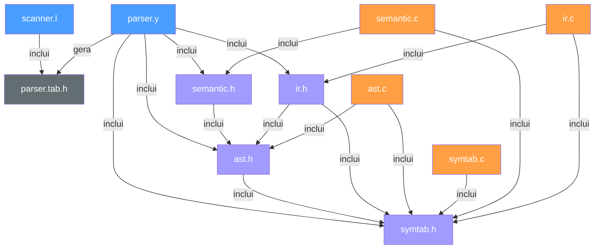

# Arquitetura do Interpretador — Documentação Técnica

> **FGA0003 — Compiladores 1**
> Curso de Engenharia de Software — Universidade de Brasília (UnB)

---

## 1. Visão Geral do Pipeline

O interpretador opera em um pipeline de **cinco fases sequenciais**, onde a saída de cada fase é a entrada da próxima. Diferentemente de um compilador convencional (que gera código objeto), nosso projeto interpreta o programa-fonte diretamente: constrói uma AST, valida semanticamente, gera código intermediário (TAC), otimiza-o e o executa.

```
┌──────────────┐  tokens  ┌──────────────┐   AST   ┌──────────────┐
│   Scanner    │─────────▶│    Parser     │────────▶│   Análise    │
│   (Flex)     │          │   (Bison)     │         │  Semântica   │
│  scanner.l   │          │   parser.y    │         │  semantic.c  │
└──────────────┘          └──────────────┘         └──────┬───────┘
                                                          │ AST validada
                                                          ▼
                          ┌──────────────┐   IR    ┌──────────────┐
                          │  Otimizador   │◀───────│  Gerador IR  │
                          │ (ir_optimize) │        │   (gen_ir)   │
                          │     ir.c      │        │    ir.c      │
                          └──────┬───────┘         └──────────────┘
                                 │ IR otimizado
                                 ▼
                          ┌──────────────┐
                          │  Execução    │──────▶ lê e escreve variáveis
                          │  (ir_exec)   │       ┌──────────────┐
                          │    ir.c      │◀─────▶│   Tabela de  │
                          └──────────────┘       │   Símbolos   │
                                                 │   symtab.c   │
                                                 └──────────────┘
```

> **Nota:** A tabela de símbolos **não** é uma fase separada — ela é um componente de armazenamento utilizado **durante** a execução. `ir_exec()` chama `sym_set()` para registrar variáveis e `sym_lookup()` para ler seus valores. Ao final, `sym_print()` exibe o estado final da tabela.

**Fluxo de execução do `main()` (em `parser.y`):**

1. O Bison invoca `yyparse()`, que chama `yylex()` repetidamente para obter tokens. Erros léxicos (caracteres não reconhecidos) abortam a execução antes de qualquer fase posterior.
2. As ações semânticas do parser **apenas constroem nós da AST** — nenhum cálculo, I/O ou manipulação da tabela de símbolos ocorre nesta fase.
3. Após o parsing bem-sucedido, `ast_root` aponta para a raiz da AST.
4. A AST é impressa para depuração (`print_ast`).
5. A análise semântica (`analyze_ast`) percorre a AST inteira para detectar erros estáticos.
6. O gerador de IR (`gen_ir`) traduz a AST para Código de Três Endereços (TAC).
7. O TAC original é impresso (`ir_print`).
8. O otimizador (`ir_optimize`) aplica 6 passes de otimização em loop de ponto fixo.
9. O TAC otimizado é impresso.
10. O interpretador de IR (`ir_exec`) executa o programa, populando a tabela de símbolos (`sym_set`/`sym_lookup`) à medida que processa declarações e atribuições.
11. A tabela de símbolos final é impressa (`sym_print`) e toda memória é liberada (`free_ast`, `ir_free`, `sym_free`).

> **Decisão de projeto chave:** a separação rigorosa entre construção da AST (parsing), validação semântica, geração de IR e execução permite inserir ou remover fases sem alterar as demais.

---

## 2. Análise Léxica — `scanner.l`

O analisador léxico é implementado em **Flex** e é responsável por decompor o texto-fonte em tokens tipados.

### 2.1 Categorias de tokens reconhecidos

| Categoria              | Exemplos                         | Token(s) Bison          |
| ---------------------- | -------------------------------- | ----------------------- |
| Literais inteiros      | `42`, `0`, `1000`                | `NUM`                   |
| Literais float         | `3.14`, `.5`, `10.`              | `FLOAT_LIT`             |
| Literais caractere     | `'a'`, `'\n'`, `'\0'`            | `CHAR_LIT`              |
| Literais booleanos     | `true`, `false`                  | `TRUE_LIT`, `FALSE_LIT` |
| Identificadores        | `x`, `contador`, `_var1`         | `ID`                    |
| Palavras-chave tipo    | `int`, `float`, `char`, `bool`   | `T_INT`, `T_FLOAT`, ... |
| Controle de fluxo      | `if`, `else`, `while`, `for`     | `KW_IF`, `KW_ELSE`, ... |
| Operadores aritméticos | `+`, `-`, `*`, `/`               | `PLUS`, `MINUS`, ...    |
| Operadores relacionais | `<`, `>`, `<=`, `>=`, `==`, `!=` | `LT`, `GT`, `LE`, ...   |
| Operadores lógicos     | `&&`, `\|\|`, `!`                | `AND`, `OR`, `NOT`      |
| Delimitadores          | `(`, `)`, `{`, `}`, `;`, `=`     | `LPAREN`, `ASSIGN`, ... |

### 2.2 Detalhes de implementação relevantes

- **Maximal munch para floats:** a regra de ponto flutuante (`[0-9]+\.[0-9]*|\.[0-9]+`) aparece **antes** da regra de inteiros. Isso garante que `3.14` seja reconhecido como `FLOAT_LIT` e não como `NUM` + `.` + `NUM`.

- **Conversão segura:** literais inteiros são convertidos via `strtol()` com verificação de `errno == ERANGE` e limite `INT_MAX`. Literais float usam `strtod()` com verificação de overflow.

- **Escape sequences:** o scanner suporta as sequências de escape padrão C (`\a`, `\b`, `\f`, `\n`, `\r`, `\t`, `\v`, `\\`, `\'`, `\"`, `\?`, `\0`). Escapes não reconhecidos geram um aviso e utilizam o caractere literal que segue a barra.

- **Palavras-chave vs. identificadores:** as regras de palavras-chave (`int`, `if`, `true`, etc.) são posicionadas **antes** da regra geral de identificadores. Como o Flex prioriza a primeira regra em caso de empate, isso garante que `int` seja reconhecido como `T_INT` e não como `ID`.

- **Valores semânticos:** cada token carrega seu valor na `yylval` adequada. Por exemplo, `NUM` preenche `yylval.intValue` via `strtol()`, enquanto `ID` aloca uma cópia com `strdup()` em `yylval.strValue`.

- **Tratamento de erros:** caracteres não reconhecidos são reportados em `stderr` e o contador `lexical_errors` é incrementado. Se ao final houver erros léxicos, o `main()` recusa a execução.

### 2.3 Diferenças em relação ao C padrão

| Aspecto            | Nosso interpretador                   | C padrão (ISO C11)                                                          |
| ------------------ | ------------------------------------- | --------------------------------------------------------------------------- |
| Literais float     | Apenas notação decimal (`3.14`, `.5`) | Suporta também notação científica (`1e-3`) e hexadecimal float (`0x1.fp10`) |
| Literais inteiros  | Apenas base decimal                   | Suporta octal (`077`), hexadecimal (`0xFF`) e binário (`0b1010` no C23)     |
| Literais caractere | Escapes básicos suportados            | Suporta também escapes octais (`\077`) e hexadecimais (`\x7F`)              |
| Strings            | **Não suportadas** como tipo completo | Strings com tipo `char[]`/`char*`, concatenação, etc.                       |
| Comentários        | **Não suportados**                    | `//` e `/* */`                                                              |
| Preprocessador     | **Inexistente**                       | `#include`, `#define`, `#ifdef`, etc.                                       |

---

## 3. Análise Sintática — `parser.y`

O parser é implementado em **Bison** e produz uma gramática **LALR(1)** que constrói a AST.

### 3.1 Estrutura da gramática

```
program
  └─ line_list           (lista encadeada de statements)
       └─ line
            └─ stmt
                 ├─ expr SEMICOLON           → AST_EXPR_STMT
                 ├─ ID ASSIGN expr ;         → AST_ASSIGN
                 ├─ type_spec ID ;           → AST_DECL (sem init)
                 ├─ type_spec ID = expr ;    → AST_DECL (com init)
                 ├─ if (expr) stmt [else stmt] → AST_IF
                 ├─ while (expr) stmt        → AST_WHILE
                 ├─ for (init;cond;step) stmt → AST_FOR
                 └─ { stmt_list }            → AST_BLOCK
```

### 3.2 Precedência de operadores

A precedência é definida de menor para maior:

```
OR  <  AND  <  EQ NE  <  LT GT LE GE  <  PLUS MINUS  <  TIMES DIVIDE  <  NOT UMINUS
```

Essa hierarquia replica fielmente a do C padrão para o subconjunto de operadores suportados.

### 3.3 Conflito shift/reduce do _dangling-else_

A gramática apresenta **exatamente 1 conflito shift/reduce** esperado, causado pela ambiguidade clássica do _dangling-else_. O Bison resolve por **shift** (associa o `else` ao `if` mais interno), que é a semântica padrão do C. Isso é declarado explicitamente com `%expect 1`.

### 3.4 Construção de listas com `append_node()`

Os nós da AST são encadeados em listas via o campo `next` do `ASTNode`. A função `append_node()` percorre a lista até o final e anexa o novo nó. Essa abordagem resulta em complexidade **O(n²)** para a construção de listas longas, mas é suficiente para os programas-fonte do escopo do projeto.

### 3.5 Liberação de memória de identificadores

Quando o scanner aloca um `strdup()` para um identificador e o parser o consome em uma ação semântica (ex: `new_assign_node($1, $3)`), o construtor do nó faz sua **própria cópia interna** via `strdup()`. A ação semântica então chama `free($1)` para liberar a cópia do Flex, evitando memory leaks.

### 3.6 Diferenças em relação ao C padrão

| Aspecto                       | Nosso interpretador                                                            | C padrão                                                                  |
| ----------------------------- | ------------------------------------------------------------------------------ | ------------------------------------------------------------------------- |
| Declarações                   | Apenas uma variável por declaração (`int x;`)                                  | Suporta múltiplas (`int x, y, z;`) e declaração com ponteiros (`int *p;`) |
| Inicialização no `for`        | Declaração ou atribuição (apenas 1 variável)                                   | Qualquer expressão, incluindo operador vírgula                            |
| Step do `for`                 | Apenas atribuição (`i = i + 1`)                                                | Qualquer expressão (`i++`, `i += 1`, chamadas)                            |
| `printf` / I/O                | O interpretador imprime automaticamente resultados de expressões e atribuições | Requer chamadas explícitas a `printf()`, `scanf()`, etc.                  |
| Funções                       | **Não suportadas**                                                             | Declaração, definição e chamada de funções                                |
| Arrays e ponteiros            | **Não suportados**                                                             | Tipos fundamentais da linguagem                                           |
| `switch`, `do-while`          | **Não suportados**                                                             | Construções padrão de controle de fluxo                                   |
| `break`, `continue`, `return` | **Não suportados**                                                             | Saída antecipada de loops e funções                                       |
| Operador vírgula              | **Não suportado**                                                              | Avaliação sequencial de expressões                                        |
| Operadores bit-a-bit          | **Não suportados** (`&`, `\|`, `^`, `~`, `<<`, `>>`)                           | Suportados                                                                |
| Incremento/decremento         | **Não suportados** (`++`, `--`)                                                | Operadores unários pré/pós-fixados                                        |
| Operadores compostos          | **Não suportados** (`+=`, `-=`, `*=`, `/=`)                                    | Atribuição composta                                                       |

---

## 4. Árvore Sintática Abstrata (AST) — `ast.h` / `ast.c`

### 4.1 Estrutura do nó

Cada nó da AST é uma `struct ASTNode` com uma `union` discriminada (tagged union) que minimiza o uso de memória. O campo `kind` (a _tag_) determina qual membro da union é válido. Suporta **14 tipos de nós**.

### 4.2 O campo `next` — Lista intrusiva

O campo `next` na **base** da struct (fora da union) permite que **qualquer** tipo de nó participe de uma lista encadeada. Esse padrão é chamado de **lista intrusiva** (_intrusive list_).

### 4.3 Codificação de operadores

| Operador           | Código interno             | Lógica                              |
| ------------------ | -------------------------- | ----------------------------------- |
| `+`, `-`, `*`, `/` | `'+'`, `'-'`, `'*'`, `'/'` | Caractere ASCII diretamente         |
| `<`, `>`           | `'<'`, `'>'`               | Caractere ASCII diretamente         |
| `&&`               | `'&'`                      | Caractere que representa o conceito |
| `\|\|`             | `'\|'`                     | Caractere que representa o conceito |
| `!`                | `'!'`                      | Caractere ASCII diretamente         |
| `==`               | `'E'`                      | Mnemônico: **E**qual                |
| `!=`               | `'N'`                      | Mnemônico: **N**ot equal            |
| `<=`               | `'l'`                      | Mnemônico: **l**ess-or-equal        |
| `>=`               | `'g'`                      | Mnemônico: **g**reater-or-equal     |

### 4.4 Alocação e liberação de memória

- **Alocação:** `alloc_node()` usa `calloc(1, sizeof(ASTNode))`, que zera toda a memória.
- **Liberação:** `free_ast()` percorre recursivamente toda a árvore (incluindo `->next`), liberando strings duplicadas e os próprios nós em **pós-ordem**.

---

## 5. Análise Semântica — `semantic.h` / `semantic.c`

A análise semântica é executada **após** o parsing e **antes** da geração de IR. Percorre a AST inteira — incluindo todos os branches e dead code — para detectar erros estáticos.

### 5.1 Tabela Shadow

Utiliza uma tabela auxiliar independente (`ShadowEntry`) que armazena apenas `(nome, tipo)` das variáveis declaradas, sem alterar a tabela de símbolos real. Essa separação permite que a análise semântica opere de forma "pura" sobre a AST.

### 5.2 Verificações realizadas

| Verificação            | Tipo  | Comportamento                                |
| ---------------------- | ----- | -------------------------------------------- |
| Variável não declarada | Erro  | Uso de identificador sem declaração prévia   |
| Redeclaração           | Erro  | Declaração de variável com nome já existente |
| Divisão por zero       | Erro  | Divisor literal zero em expressão de divisão |
| `float → int`          | Aviso | Possível perda de precisão                   |
| `float → char`         | Aviso | Possível perda de precisão                   |
| `int → char`           | Aviso | Possível truncamento                         |
| numérico → `bool`      | Aviso | Normalização para 0/1                        |

Erros impedem a execução; avisos são impressos em `stderr` mas o programa prossegue.

### 5.3 Diferenças em relação ao C padrão

| Aspecto           | Nosso interpretador                                 | C padrão                                     |
| ----------------- | --------------------------------------------------- | -------------------------------------------- |
| Escopo de análise | Analisa **todos** os branches (incluindo dead code) | Compiladores podem ou não analisar dead code |
| Short-circuit     | **Não implementado** — ambos operandos de `&&` e `\|\|` são avaliados | Avaliação curto-circuito é garantida |

---

## 6. Código Intermediário e Execução — `ir.h` / `ir.c`

### 6.1 Geração de IR

A função `gen_ir()` percorre a AST e produz uma lista linear de instruções TAC. O módulo mantém seu próprio _ambiente de tipos_ (`TypeEntry`) preenchido a partir das declarações.

### 6.2 Otimização

`ir_optimize()` executa **6 passes** em loop de ponto fixo:

1. **Constant Folding** — resolve operações com constantes em tempo de compilação.
2. **Constant Propagation** — substitui usos de temporários constantes pelo valor.
3. **Dead Code Elimination** — remove código inalcançável e resolve desvios constantes.
4. **Dead Temp Elimination** — remove definições de temporários nunca lidos.
5. **Redundant Goto Elimination** — remove `goto Lk` seguido de `Lk:`.
6. **Dead Label Elimination** — remove rótulos sem referências.

### 6.3 Execução

`ir_exec()` lineariza as instruções em array, constrói um mapa de rótulos (`label_map`) e interpreta com ponteiro de instrução (`ip`). Desvios (`goto`, `ifFalse`) alteram o `ip`.

O tipo interno `IRValue` (`{double val; SymType type}`) é o equivalente funcional de um resultado de expressão — usa `double` como tipo universal para simplificar cálculos intermediários.

### 6.4 Sistema de tipos e promoção na execução

A função `promote_type()` implementa **promoção aritmética simplificada**: se qualquer operando for float, o resultado é float; caso contrário, int. Divisão inteira trunca, divisão por zero causa término imediato.

### 6.5 Saída automática

O interpretador imprime automaticamente:

- **Declarações:** `Declarado: x : int = 0`
- **Atribuições:** `int x = 5`
- **Expressões livres (`expr;`):** `Resultado: 42`

### 6.6 Diferenças na execução em relação ao C padrão

| Aspecto                   | Nosso interpretador                                  | C padrão                            |
| ------------------------- | ---------------------------------------------------- | ----------------------------------- |
| Representação interna     | Todos os valores intermediários são `double`         | Tipos preservam tamanho nativo      |
| Float na tabela           | `float` (32 bits), intermediários `double` (64 bits) | `float` 32 bits, `double` 64 bits   |
| Overflow de inteiros      | Limitado à precisão do `double` (~2⁵³)               | Undefined behavior                  |
| Escopo de variáveis       | **Escopo global único**                              | Blocos criam escopo léxico          |
| Redeclaração              | Erro fatal (detectado estaticamente)                 | Permitida em escopos diferentes     |
| `for` init com declaração | Variável persiste após o loop                        | Variável destruída ao sair do `for` |

---

## 7. Tabela de Símbolos — `symtab.h` / `symtab.c`

### 7.1 Estrutura de dados

Hash table de tamanho fixo (211 buckets, primo) com encadeamento externo (_chaining_). Função de hash: djb2 de Dan Bernstein.

### 7.2 Armazenamento de valores tipados

`SymValue` (union discriminada): `iVal` para `TYPE_INT`/`TYPE_BOOL`, `fVal` para `TYPE_FLOAT`, `cVal` para `TYPE_CHAR`.

---

## 8. Compilação e Build — `Makefile`

### 8.1 `parser_exe` — O interpretador principal

```
Bison (parser.y) → parser.tab.c + parser.tab.h
Flex  (scanner.l) → lex.yy.c    (depende de parser.tab.h)
GCC: parser.tab.c + lex.yy.c + ast.c + semantic.c + ir.c + symtab.c → parser_exe
```

Não linka com `-lfl` porque `parser.y` fornece `main()` e `scanner.l` fornece `yywrap()`.

### 8.2 Diretório de build

Todos os artefatos gerados ficam no diretório `build/`, mantendo o diretório-fonte limpo.

---

## 9. Arquitetura de Testes

O projeto utiliza **pytest** como framework de testes, com o executável C compilado como backend:

```
pytest (Python)
  ├─ test_scanner.py      → invoca parser_exe (testes de tokens)
  ├─ test_parser.py       → invoca parser_exe (testes de sintaxe, semântica, execução)
  ├─ test_ir.py           → invoca parser_exe (testes de geração de TAC)
  └─ test_ir_optimize.py  → invoca parser_exe (testes de otimização do IR)
```

---

## 10. Diagrama de Dependências entre Módulos



**Legenda:** 🔵 Fontes Flex/Bison | 🟠 Implementações C | 🟣 Cabeçalhos | ⚫ Gerado

---

## 11. Resumo das Diferenças mais Significativas em Relação ao C Padrão

### O que implementamos fielmente:

- ✅ Precedência e associatividade dos operadores suportados
- ✅ Divisão inteira entre inteiros, divisão real entre floats
- ✅ Promoção aritmética implícita (char/bool → int, int → float)
- ✅ Conversão implícita na atribuição (narrowing)
- ✅ Semântica do _dangling-else_ (shift = `else` associa ao `if` mais interno)
- ✅ Truthiness: `0` e `0.0` são falso, qualquer outro valor é verdadeiro
- ✅ Operadores lógicos e relacionais retornam `int` (0 ou 1)
- ✅ Verificação semântica estática (variáveis não declaradas, redeclarações)

### O que **não** implementamos (simplificações intencionais):

- ❌ Escopo léxico (blocos, funções) — usamos escopo global único
- ❌ Short-circuit evaluation em `&&` e `||`
- ❌ Funções (declaração, definição, chamada, recursão)
- ❌ Arrays, ponteiros e alocação dinâmica
- ❌ Tipos `double`, `long`, `short`, `unsigned`, structs, enums
- ❌ Operadores `++`, `--`, `+=`, `-=`, `*=`, `/=`, `%=`
- ❌ Operador módulo `%`
- ❌ Operadores bit-a-bit (`&`, `|`, `^`, `~`, `<<`, `>>`)
- ❌ Operador ternário (`? :`)
- ❌ Operador vírgula
- ❌ `switch/case`, `do-while`, `break`, `continue`, `return`
- ❌ Preprocessador (`#include`, `#define`)
- ❌ Strings como tipo de dados completo
- ❌ I/O explícito (`printf`, `scanf`)
- ❌ Comentários (`//`, `/* */`)
- ❌ Cast explícito
- ❌ Tipo `void`
