# Evolução do Projeto e Sprints

Esta página detalha a evolução do projeto do transpilador ao longo das **6 Sprints** do semestre, sob a metodologia ágil **Scrum** e o suporte de **Pair Programming**.

---

## 1. Linha do Tempo das Sprints

O desenvolvimento do nosso transpilador C para Python seguiu uma abordagem incremental e iterativa. A divisão das entregas e objetivos foi estruturada conforme a seguir:

```mermaid
gantt
    title Planejamento e Execução (Sprints 1 a 6)
    dateFormat  X
    axisFormat %d
    section Configuração & Lexer
    Estruturação do repositório (S1/S2)   :active, 0, 10
    Mapeamento Lexer (scanner.l) (S1/S2)  :active, 5, 15
    section Sintaxe & AST
    Gramática LALR(1) no Bison (S3/S4)    :active, 10, 25
    Estruturação da AST com 14 nós (S3/S4) :active, 15, 30
    section Semântica & Testes
    Tabela de Símbolos & Tipagem (S5/S6)  :active, 25, 40
    Coerções, Fixtures & pytest (S5/S6)   :active, 30, 45
```

### Sprint 1 e Sprint 2 (Fase de Planejamento e Léxico)
* **Foco:** Configuração da infraestrutura básica (Makefile, MkDocs) e especificação formal da linguagem de entrada.
* **O que conseguimos:** Implementação inicial do scanner no arquivo [scanner.l](../src/scanner.l) para reconhecer tokens básicos e ignorar espaços em branco. Mapeamento da gramática C básica em notação EBNF.
* **O que não conseguimos:** A integração sintática ainda não existia; os tokens eram apenas testados isoladamente através de um driver léxico standalone.

### Sprint 3 e Sprint 4 (Fase Sintática e AST)
* **Foco:** Criação do parser e definição da estrutura de dados da árvore.
* **O que conseguimos:** Integração bem-sucedida entre Flex e Bison. Definição da gramática LALR(1) em [parser.y](../src/parser.y) suportando expressões, declarações e controle de fluxo básico (`if`, `while`, `for`). Implementação da estrutura de nós na AST em [ast.c](../src/ast.c) com suporte para impressão visual.
* **O que não conseguimos:** O interpretador executava cálculos sem validar tipos (todas as operações assumiam inteiros ou davam comportamento indefinido). Não havia tratamento de escopo ou tratamento correto de colisões na tabela.

### Sprint 5 e Sprint 6 (Fase Semântica e Qualidade)
* **Foco:** Análise de tipos, motor lógico de coerção, tabela de símbolos hash e testes.
* **O que conseguimos:** Implementação da Tabela de Símbolos robusta em C com algoritmo de hash `djb2` e tratamento de colisões por encadeamento. Motor lógico de coerção/promoção de tipos finalizado e testado. Criação de uma suíte com mais de 150 testes automatizados em `pytest` cobrindo comportamento sintático, semântico e erros em tempo de execução.
* **O que não conseguimos:** O gerador de código Python e o otimizador foram adiados para as próximas entregas. A execução é realizada apenas de forma interativa por um avaliador tree-walker interno em C.

---

## 2. Metodologias Adotadas

### Metodologia Ágil Scrum
O uso de Scrum permitiu à equipe:
* Planejar entregas pequenas e funcionais a cada ciclo de sprint.
* Identificar impedimentos de infraestrutura logo nas primeiras semanas.
* Dividir de maneira clara as responsabilidades em torno dos arquivos-chave (`scanner.l`, `parser.y`, `ast.c`, `symtab.c`).

### Prática de Pair Programming
No início do projeto, a equipe deparou-se com assimetrias técnicas e dificuldades na comunicação. A adoção de **Pair Programming** (programação em pares) foi o fator decisivo para a evolução técnica:
* **Nivelamento de Conhecimento:** Membros mais experientes em C e compiladores programaram junto com os demais, ajudando a disseminar melhores práticas de programação (como uso correto de ponteiros, alocação dinâmica e gerenciamento de unions).
* **Qualidade de Código Imediata:** Erros críticos de memória e lógicas semânticas incorretas foram identificados e resolvidos na fase de codificação, resultando em uma base muito mais limpa que facilitou a criação subsequente dos testes automatizados.

---

## 3. Estado Atual do Interpretador (O que faz e o que não faz)

Ao final da Sprint 6, o interpretador atingiu um marco de maturidade relevante, embora possua limitações claras de escopo delimitadas para esta entrega:

### O que CONSEGUIMOS fazer (Funcionalidades Ativas)
* **Declaração e Escrita:** Declarar e inicializar variáveis dos tipos `int`, `float`, `char` e `bool`.
* **Cálculos Matemáticos:** Avaliar expressões aritméticas compostas com precedência e associatividade de operadores matemáticos padrão.
* **Lógica e Relações:** Avaliar expressões lógicas (`&&`, `||`, `!`) e relacionais (`==`, `!=`, `<`, `>`, `<=`, `>=`).
* **Controle de Fluxo Iterativo e Condicional:** Executar loops `while`, loops `for` (com componentes de inicialização, condição e incremento opcionais) e condicionais `if` ou `if-else`.
* **Gerenciamento de Memória:** Execução do interpretador via *tree-walker* e liberação limpa de toda a memória alocada via `free_ast` e `sym_free`.

### O que NÃO CONSEGUIMOS fazer (Limitações do Escopo Atual)
* **Sem Geração de Código Python (Transpilação):** O pipeline atual executa o código C de forma interpretada diretamente na AST (`eval_ast()`). A etapa de geração do código Python equivalente é o objetivo das etapas posteriores.
* **Sem Funções:** A linguagem só suporta uma sequência global implícita de comandos; declarações de funções personalizadas, passagem de argumentos e cláusulas `return` não são suportados.
* **Sem Arrays ou Strings:** Não há suporte a tipos indexados (vetores, matrizes) ou cadeias de caracteres. Variáveis `char` só armazenam caracteres únicos.
* **Sem Ponteiros:** Operações de endereço (`&`) e desreferenciamento (`*`) não são reconhecidas.
* **Sem Estruturas Personalizadas:** Structs, unions e enums do programador não são suportados.
* **Sem Desvios de Fluxo Adicionais:** Não há suporte para `break`, `continue`, `switch-case` ou `do-while`.
